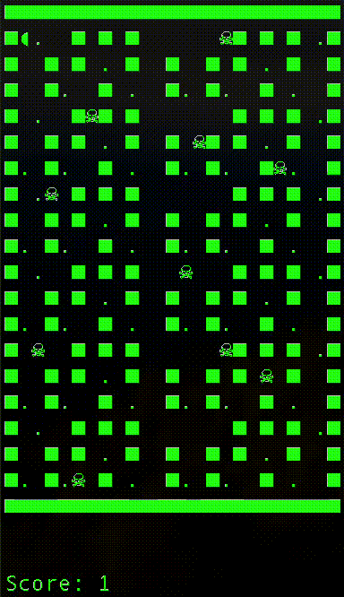

## Pacman!

Pacman is a classic arcade game implemented in C# and playable in the terminal (or command prompt). In this version, the player controls Pacman through a maze, collecting dots while avoiding enemies. The objective is to score as many points as possible while surviving the maze.

## Installation

### Clone the repository:

```bash
git clone https://github.com/yourusername/pacman.git
```

### Install .NET 9.0 (if not already installed):

- Download the latest version of .NET 9.0 from the official [.NET website](https://dotnet.microsoft.com/download/dotnet).
- Follow the installation instructions based on your operating system.

### Run the game:

1. Open a terminal (or command prompt) in the project folder.
2. Run the following command:
   ```bash
   dotnet run
   ```

## Screenshot



## License

This project is licensed under the MIT License - see the [LICENSE](LICENSE) file for details.
